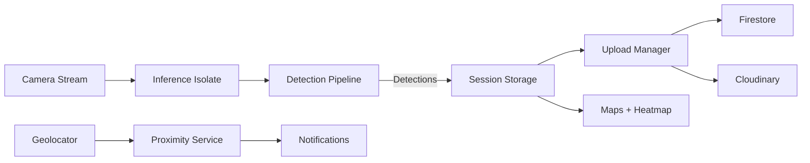

# Street Scan Mobile

Real-time pothole detection with road condition reporting and mapping for iOS and Android.

## Table of Contents

- [Introduction](#introduction)
- [Key Features](#key-features)
- [Architecture](#architecture)
- [Project Structure](#project-structure)
- [Getting Started](#getting-started)
- [Usage](#usage)
- [User Tutorial](#user-tutorial)
- [Core Services API](#core-services-api)
- [Configuration](#configuration)
- [Contributing](#contributing)
- [License](#license)
- [Support](#support)

## Introduction

Street Scan is a high-performance Flutter application that uses on-device TFLite models to detect potholes in real time, logs detections with GPS metadata, and visualizes road conditions on interactive maps. It is optimized for smooth camera preview by running inference in a dedicated isolate and by throttling the detection pipeline.

## Key Features

- Real-time camera detection with TFLite (YOLOv11-style output parsing)
- Inference isolate to keep UI smooth and responsive
- Snapshot capture and local session storage via Hive
- Upload manager with background sync, retries, and progress UI
- Proximity alerts based on local and server pothole data
- Map views with markers and heatmap overlays

## Architecture



<details>
  <summary>Entry Point and Runtime Flow</summary>

- Entry point: [lib/main.dart](lib/main.dart)
- Initializes Firebase, Hive, permissions, notifications, and proximity service
- Creates a `ChangeNotifierProvider` for upload state
- Launches the main UI with cameras discovered at runtime

</details>

## Project Structure

```text
assets/
  model_clabels.txt
  models/
lib/
  main.dart
  core/
    detection/
    models/
    services/
    utils/
  screens/
  widgets/
```

| Area | Description |
| --- | --- |
| [lib/main.dart](lib/main.dart) | App entry, initialization, DI wiring, and routes |
| [lib/core/services](lib/core/services) | Detection pipeline, uploads, notifications, proximity, storage |
| [lib/core/detection](lib/core/detection) | Preprocessing, YOLO output parsing, overlay rendering |
| [lib/screens](lib/screens) | UI flows (live detection, map, sessions, upload manager) |
| [assets/models](assets/models) | TFLite models used for inference |

## Getting Started

### Prerequisites

- Flutter SDK (Dart 3.8+)
- Android Studio / Xcode for platform builds
- Firebase project configured for Android/iOS
- See [requirements.txt](requirements.txt) for the full list

### Install

```bash
flutter pub get
```

### Environment Setup

1. Copy [.env.example](.env.example) to [.env](.env)
2. Fill in the required keys for your Firebase, MapTiler, and Cloudinary projects

### Run

```bash
flutter run -d <device-id>
```

### Validate

```bash
flutter analyze
flutter test
```

<details>
  <summary>TFLite Models</summary>

Models are loaded from assets and configured in [lib/core/services/config/detection_settings.dart](lib/core/services/config/detection_settings.dart). The active default model is:

- assets/models/float16_320.tflite

If you add new models, ensure input/output shapes match the output parser in [lib/core/detection/yolo_output_parser.dart](lib/core/detection/yolo_output_parser.dart).

</details>

## Usage

### Live Detection

- Start detection from the live camera screen: [lib/screens/live_detection_screen.dart](lib/screens/live_detection_screen.dart)
- The detection pipeline converts YUV frames in an isolate and returns bounding boxes
- Snapshots are throttled by `DetectionConfig.snapshotIntervalMs`

### Upload Manager

- Manage and batch uploads from [lib/screens/upload_manager_screen.dart](lib/screens/upload_manager_screen.dart)
- Uploads are written to Firestore and images to Cloudinary

### Fullscreen Map

- View heatmaps and global markers in [lib/screens/fullscreen_map.dart](lib/screens/fullscreen_map.dart)

## User Tutorial

For a step-by-step guide on using the app (permissions, detection flow, session review, maps, uploads, and alerts), see [tutorial.md](tutorial.md).

## Core Services API

| Service | Purpose | Key Files |
| --- | --- | --- |
| Detection Pipeline | Orchestrates inference and UI updates | [lib/core/services/detection_pipeline.dart](lib/core/services/detection_pipeline.dart) |
| Inference Isolate | Offloads preprocessing and inference | [lib/core/services/inference_isolate.dart](lib/core/services/inference_isolate.dart) |
| Pothole Detector | TFLite interpreter wrapper | [lib/core/services/pothole_detector.dart](lib/core/services/pothole_detector.dart) |
| Upload Manager | Batch uploads + progress | [lib/core/services/upload_manager.dart](lib/core/services/upload_manager.dart) |
| Firebase Service | Firestore + queue handling | [lib/core/services/firebase_service.dart](lib/core/services/firebase_service.dart) |
| Cloudinary Service | Image upload + dedupe | [lib/core/services/cloudinary_service.dart](lib/core/services/cloudinary_service.dart) |
| Proximity Service | Nearby pothole alerts | [lib/core/services/proximity_service.dart](lib/core/services/proximity_service.dart) |
| Local Storage | Hive-backed session storage | [lib/core/services/local_storage_service.dart](lib/core/services/local_storage_service.dart) |

## Configuration

> ** Note:
> Environment values are loaded via [.env](.env) at app startup. > You can use
[.env.example](.env.example) as the template.

### Firebase

- Firebase initialization uses [lib/firebase_options.dart](lib/firebase_options.dart)
- Update Firebase keys in [.env](.env)

### Map Tiles

- MapTiler configuration is read from [.env](.env)

### Cloudinary

- Cloudinary configuration is read from [.env](.env)

## Contributing

1. Fork the repository
2. Create a feature branch
3. Add tests or verification steps for new logic
4. Open a PR with a clear description and screenshots if UI changes

## License

All rights reserved.

## Support

For questions, open an issue or reach out to me! Happy coding!