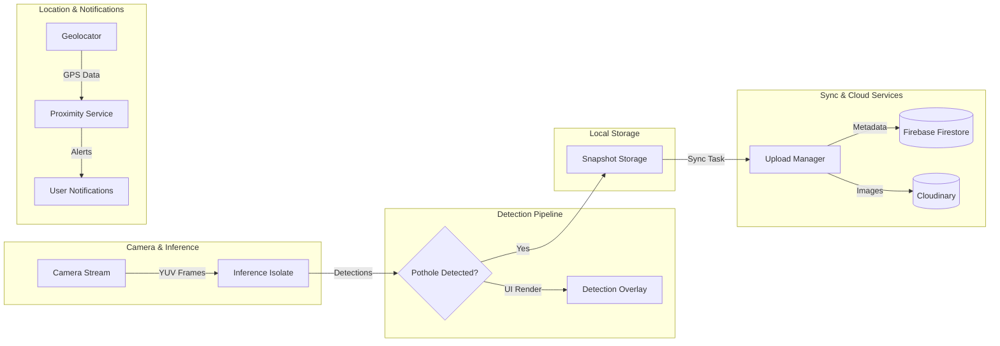

# Street Scan Mobile

Real-time pothole detection with road condition reporting and mapping mobile application.

For iOS and Android.

## 🚀 Project Overview

Street Scan is a high-performance Flutter application designed for real-time pothole detection, road condition reporting, and spatial mapping.

### Key Features
- **Real-time AI Detection**: Leverages TFLite models (YOLOv8) running on a dedicated Background Isolate for stutter-free preview.
- **Proximity Alerts**: Background geolocation service that alerts users when approaching known potholes.
- **Seamless Uploads**: Robust `UploadManager` that batches local captures to Firebase (Firestore) and Cloudinary (Storage) with progress notifications.
- **Geospatial Mapping**: Integrated map views (mini & fullscreen) with interactive markers and heatmap overlays powered by MapTiler.
- **Local Storage**: Uses Hive, a No-SQL based local persistence for offline session management and synchronization.

## 🏗️ Architecture



## 📂 Core Structure & Detection

### Detection & Capture
- **Live Detection** ([lib/screens/live_detection_screen.dart](lib/screens/live_detection_screen.dart))
    - Purpose: High-speed camera preview with real-time YOLOv8 bounding box overlays.
    - Isolate Pattern: Offloads heavy image processing to `inference_isolate.dart` to maintain 60FPS UI.
- **Detection Pipeline** ([lib/core/services/detection_pipeline.dart](lib/core/services/detection_pipeline.dart))
    - Logic for debouncing detections, managing snapshot queues, and mapping detections to spatial coordinates.
- **Pothole Detector** ([lib/core/services/pothole_detector.dart](lib/core/services/pothole_detector.dart))
    - The TFLite interpreter wrapper handling model loading and raw tensor inference.

### Services & Logic
- **Upload Manager** ([lib/core/services/upload_manager.dart](lib/core/services/upload_manager.dart))
    - Handles background batching, retry logic, and synchronization between local data and remote Firebase/Cloudinary.
- **Proximity Service** ([lib/core/services/proximity_service.dart](lib/core/services/proximity_service.dart))
    - Background GPS listener that cross-references user location with a global pothole database to provide real-time alerts.
- **LocalStorage Service** ([lib/core/services/local_storage_service.dart](lib/core/services/local_storage_service.dart))
    - Centralized Hive manager for session metadata and persistent settings.

## 🎨 Visuals & UI

### App Screenshots
> *Placeholder: Add actual screenshots to `assets/screenshots/` and update links*

| Home & Maps | Live Detection | Upload Manager |
| :---: | :---: | :---: |
|  |  |  |

## 🛠️ Developer Workflow

1. **Install Dependencies**
   ```powershell
   flutter pub get
   ```

2. **Check for Issues**
   ```powershell
   flutter analyze
   ```

3. **Running the App**
   - For physical devices: `flutter run -d <device-id>`
   - To build for release: `flutter build apk --release`

4. **TFLite Setup**
   Model files are located in `assets/models/`. If updating models, ensure the input/output shapes match `YOLOOutputParser` in [lib/core/detection/yolo_output_parser.dart](lib/core/detection/yolo_output_parser.dart).
